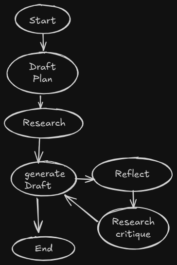

# 🧠 Research Agent with LangGraph

A multi-agent system built using **LangGraph** that automates the research and writing workflow. The agent iteratively plans, researches, drafts, reflects, and critiques a topic to generate high-quality content using LLMs.

---

## 🚀 Features

- 📋 **Draft Planning**: Generates an initial structure and goals for the topic.
- 🔍 **Automated Research**: Gathers context from external sources or APIs (can be extended).
- ✍️ **Draft Generation**: Produces a draft based on research.
- 🤔 **Reflection Agent**: Reviews the quality of the draft.
- 🧐 **Critique Agent**: Suggests improvements and identifies flaws.
- 🔁 **Feedback Loop**: Iteratively improves the draft until the final version is ready.

---

## 📊 Workflow Diagram



## 🛠️ Tech Stack

- [LangGraph](https://github.com/langchain-ai/langgraph)
- [LangChain](https://github.com/hwchase17/langchain)
- [Groq / LLM APIs](https://groq.com/)

---

## 🔧 Installation

```bash
git clone https://github.com/atharvsp189/Research-Agent-LangGraph.git
cd Research-Agent-LangGraph
pip install -r requirements.txt
```

## Usage
```
    pythob query_handler.py
    or
    streamlit run streamlit_app.py
```